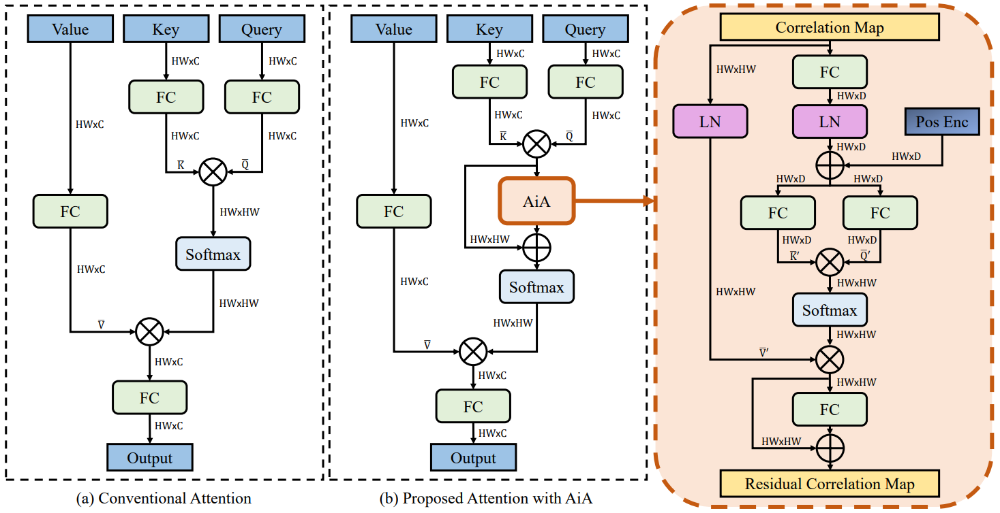

# AiATrack

The official PyTorch implementation of our **ECCV 2022** paper: 

**AiATrack: Attention in Attention for Transformer Visual Tracking**

[Shenyuan Gao](https://github.com/Little-Podi), [Chunluan Zhou](https://www.sites.google.com/view/chunluanzhou/), [Chao Ma](https://vision.sjtu.edu.cn/), [Xinggang Wang](https://xinggangw.info/), [Junsong Yuan](https://cse.buffalo.edu/~jsyuan/)

[[ECVA Open Access](https://www.ecva.net/papers.php)] [[ArXiv Preprint](https://arxiv.org/abs/2207.09603)] [[Trained Models](https://github.com/Little-Podi/AiATrack/releases/tag/downloads)] [[Raw Results](https://github.com/Little-Podi/AiATrack/releases/tag/downloads)] [[Transformer Tracking](https://github.com/Little-Podi/Transformer_Tracking)]

## Highlight



### :bookmark:Brief Introduction

Transformer trackers have achieved impressive advancements recently, where the attention mechanism plays an important role. However, the independent correlation computation in the attention mechanism could result in noisy and ambiguous attention weights, which inhibits further performance improvement. To address this issue, we propose **an attention in attention module** (named AiA), which enhances appropriate correlations and suppresses erroneous ones by seeking consensus among all correlation vectors. Our AiA module can be readily applied to both self-attention blocks and cross-attention blocks to facilitate feature aggregation and information propagation for visual tracking. Moreover, we propose **a streamlined Transformer tracking framework** (dubbed AiATrack), by introducing efficient feature reuse and target-background embeddings to make full use of temporal references. Experiments show that our tracker achieves state-of-the-art performance on several tracking benchmarks while running at a real-time speed.

### :bookmark:Strong Performance

The proposed AiATrack sets state-of-the-art results on 8 widely used benchmarks. Using ResNet-50 pre-trianed on ImageNet-1k, we can get: 

| Benchmark (Metrics)                | AiATrack              | Leaderboard                                                  |
| ---------------------------------- | --------------------- | ------------------------------------------------------------ |
| LaSOT (AUC / Norm P / P)           | 69.0 / 79.4 / 73.8    | [](https://paperswithcode.com/sota/visual-object-tracking-on-lasot?p=aiatrack-attention-in-attention-for) |
| LaSOT Extension (AUC / Norm P / P) | 47.7 / 55.6 / 55.4    |                                                              |
| TrackingNet (AUC / Norm P / P)     | 82.7 / 87.8 / 80.4    | [](https://paperswithcode.com/sota/visual-object-tracking-on-trackingnet?p=aiatrack-attention-in-attention-for) |
| GOT-10k (AO / SR 0.75 / SR 0.5)    | 69.6 / 63.2 / 80.0    | [](https://paperswithcode.com/sota/visual-object-tracking-on-got-10k?p=aiatrack-attention-in-attention-for) |
| NfS30 (AUC)                        | 67.9                  | [](https://paperswithcode.com/sota/visual-object-tracking-on-needforspeed?p=aiatrack-attention-in-attention-for) |
| OTB100 (AUC)                       | 69.6                  | [](https://paperswithcode.com/sota/visual-object-tracking-on-otb-100?p=aiatrack-attention-in-attention-for) |
| UAV123 (AUC)                       | 70.6                  | [](https://paperswithcode.com/sota/visual-object-tracking-on-uav123?p=aiatrack-attention-in-attention-for) |
| VOT2020 (EAO / A / R)              | 0.530 / 0.764 / 0.827 |                                                              |

### :bookmark:Inference Speed

The proposed AiATrack can run at 38fps (frames per second) on a single NVIDIA GeForce RTX 2080 Ti.

### :bookmark:Training Cost

It takes nearly two days to train our model on 8 NVIDIA GeForce RTX 2080 Ti (each of which has 11GB GPU memory).

### :bookmark:Model Complexity

The proposed AiATrack has 15.79M (million) model parameters.

## Release

**Trained Models** (containing the model we trained on four datasets and the model we trained on GOT-10k only) [[download zip file](https://github.com/Little-Podi/AiATrack/releases/download/downloads/Trained_Models.zip)]

**Raw Results** (containing raw tracking results on the datasets we benchmarked in the paper) [[download zip file](https://github.com/Little-Podi/AiATrack/releases/download/downloads/Raw_Results.zip)]

Download and unzip these two zip files under AiATrack project path, then both of them can be directly used by our code.

## Let's Get Started

- ### Environment

  Our experiments are conducted with Ubuntu 18.04 and CUDA 10.1.

- ### Preparation

  - Clone our repository to your local project directory.

  - Download the training datasets ([LaSOT](http://vision.cs.stonybrook.edu/~lasot/download.html), [TrackingNet](https://github.com/SilvioGiancola/TrackingNet-devkit), [GOT-10k](http://got-10k.aitestunion.com/downloads), [COCO2017](https://cocodataset.org/#download)) and testing datasets ([NfS](http://ci2cv.net/nfs/index.html), [OTB](http://cvlab.hanyang.ac.kr/tracker_benchmark/datasets.html), [UAV123](https://cemse.kaust.edu.sa/ivul/uav123)) to your disk, the organized directory should look like: 

    ```
    --LaSOT/
    	|--airplane
    	|...
    	|--zebra
    --TrackingNet/
    	|--TRAIN_0
    	|...
    	|--TEST
    --GOT10k/
    	|--test
    	|--train
    	|--val
    --COCO/
    	|--annotations
    	|--images
    --NFS30/
    	|--anno
    	|--sequences
    --OTB100/
    	|--Basketball
    	|...
    	|--Woman
    --UAV123/
    	|--anno
    	|--data_seq
    ```

  - Edit the **PATH** in ```lib/test/evaluation/local.py``` and ```lib/train/adim/local.py``` to the proper absolute path.

- ### Installation

  We use conda to manage the environment.

  ```
  conda create --name aiatrack python=3.6
  conda activate aiatrack
  sudo apt-get install ninja-build
  sudo apt-get install libturbojpeg
  bash install.sh
  ```

- ### Training

  - Multiple GPU training by DDP (suppose you have 8 GPU)

    ```
    python tracking/train.py --mode multiple --nproc 8
    ```

  - Single GPU debugging (too slow, not recommended for training)

    ```
    python tracking/train.py
    ```

  - For GOT-10k evaluation, remember to set ```--config baseline_got```.

- ### Evaluation

  - Make sure you have prepared the trained model.

  - On large-scale benchmarks: 

    - LaSOT

      ```
      python tracking/test.py --dataset lasot
      python tracking/test.py --dataset lasot_ext
      ```

      Then evaluate the raw results using the [official MATLAB toolkit](https://github.com/HengLan/LaSOT_Evaluation_Toolkit).

    - TrackingNet

      ```
      python tracking/test.py --dataset trackingnet
      python lib/test/utils/transform_trackingnet.py --tracker_name aiatrack --cfg_name baseline
      ```

      Then upload ```test/tracking_results/aiatrack/baseline/trackingnet_submit.zip``` to the [online evaluation server](https://eval.ai/web/challenges/challenge-page/1805/overview).

    - GOT-10k

      ```
      python tracking/test.py --param baseline_got --dataset got10k_test
      python lib/test/utils/transform_got10k.py --tracker_name aiatrack --cfg_name baseline_got
      ```

      Then upload ```test/tracking_results/aiatrack/baseline_got/got10k_submit.zip``` to the [online evaluation server](http://got-10k.aitestunion.com/submit_instructions).

  - On small-scale benchmarks: 

    - NfS30, OTB100, UAV123

      ```
      python tracking/test.py --dataset nfs
      python tracking/test.py --dataset otb
      python tracking/test.py --dataset uav
      python tracking/analysis_results.py
      ```

      As previous works did, the frames where the target object doesn't exist will be excluded during the analysis.

  - For multiple threads inference, just add ```--threads 40``` after ```tracking/test.py``` (suppose you want to use 40 threads in total).

  - To show the immediate prediction result during inference, modify ```settings.show_result = True``` in ```lib/test/evaluation/local.py``` (may have bugs if you try this on a remote sever).

  - Please refer to [STARK+Alpha-Refine](https://github.com/researchmm/Stark/blob/main/external/AR/README.md) for VOT integration and [DETR Tutorial](https://colab.research.google.com/github/facebookresearch/detr/blob/colab/notebooks/detr_attention.ipynb) for correlation map visualization.

## Acknowledgement

:heart::heart::heart:Our idea is implemented base on the following projects. We really appreciate their wonderful open-source work!

- [STARK](https://github.com/researchmm/Stark) [[related paper](https://arxiv.org/abs/2103.17154)]
- [PyTracking](https://github.com/visionml/pytracking) [[related paper](https://arxiv.org/abs/1811.07628)]
- [DETR](https://github.com/facebookresearch/detr) [[related paper](https://arxiv.org/abs/2005.12872)]
- [PreciseRoIPooling](https://github.com/vacancy/PreciseRoIPooling) [[related paper](https://arxiv.org/abs/1807.11590)]

## Citation

If any parts of our paper and codes help your research, please consider citing us and giving a star to our repository.

```
@article{gao2022aiatrack,
  title={AiATrack: Attention in Attention for Transformer Visual Tracking},
  author={Gao, Shenyuan and Zhou, Chunluan and Ma, Chao and Wang, Xinggang and Yuan, Junsong},
  journal={arXiv preprint arXiv:2207.09603},
  year={2022}
}
```

## Contact

If you have any questions or concerns, feel free to open issues or directly contact me through the ways on my GitHub homepage. Suggestions and collaborations are also highly welcomed!
